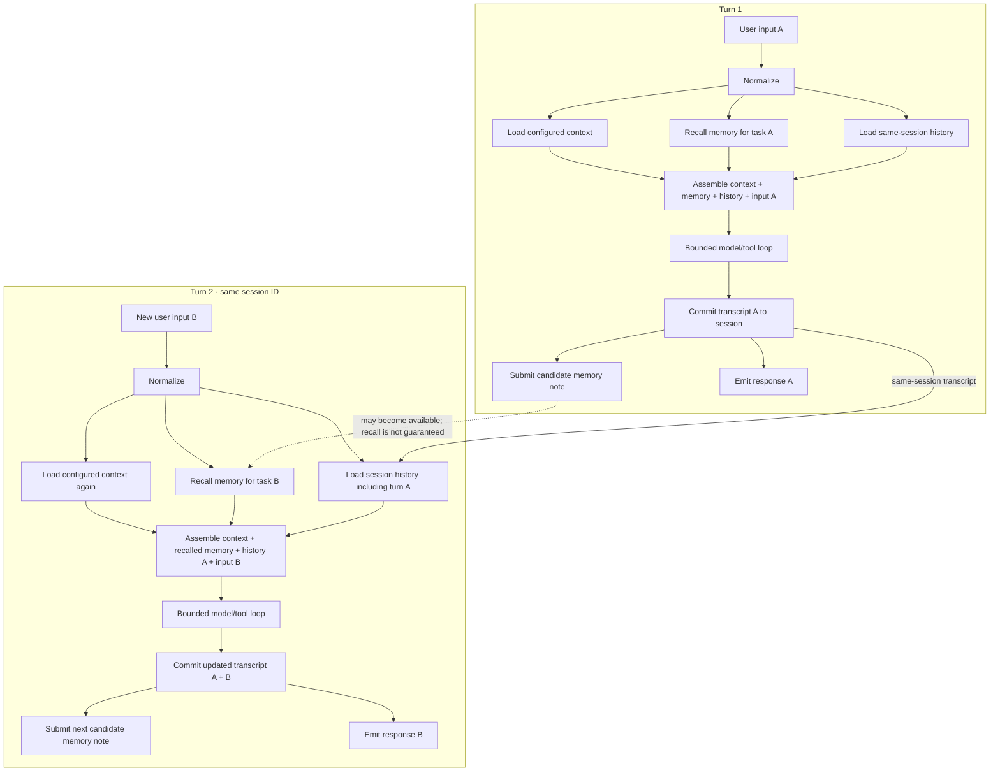
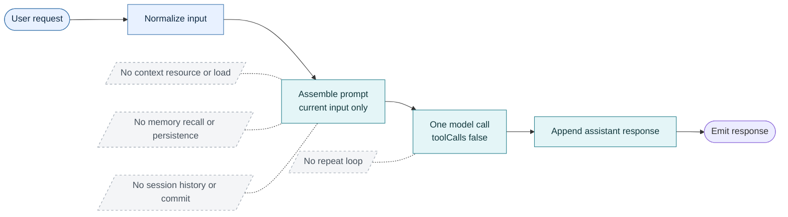

# Agent turn data flow

GitHub renders the Mermaid diagrams below directly on this page. The YAML links
open the corresponding files in the repository. For interactive profile
switching locally, open [`agent-data-flow.html`](agent-data-flow.html) in a
browser; GitHub shows that HTML file as source unless it is served as a site.

This diagram follows the current [`examples/agent.yaml`](../examples/agent.yaml)
`turn` pipeline and its `agent-step`, `load-knowledge`, and `persist-knowledge`
subpipelines. A **turn** is one admitted user request. A turn may contain
several model calls and tool executions before it returns one response.

## Full harness

```mermaid
flowchart LR
    U([User request]) --> IN[Normalize input]

    IN --> CTX[Load context<br/>coding instructions and sources]
    IN --> REC[Recall relevant memory<br/>bashy kb context using memory.main]
    REC -->|lookup denied or fails| EMPTY[Use abstained empty knowledge]
    IN --> HIST[Load session history<br/>prior committed turns]
    IN --> PROBE[Harness-authored Bashy workspace probe]

    CTX --> ASM[Assemble prompt in declared order<br/>context · knowledge · history · current input]
    REC --> ASM
    EMPTY --> ASM
    HIST --> ASM

    ASM --> CP[Checkpoint turn state]
    CP --> LOOP{{Repeat agent-step<br/>maximum 25 iterations}}

    subgraph STEP[One agent step]
      direction TB
      Q[Drain steering and interrupt queue] --> MEASURE[Measure context budget]
      MEASURE --> PREP[Preserve, truncate, or compact messages]
      PREP --> CALL[Call model<br/>route main]
      CALL --> NORMALIZE[Normalize model response]
      NORMALIZE --> APPEND[Append assistant response]
      APPEND --> DECIDE{Finished?}
      DECIDE -->|No: tool calls| EXEC[Preflight, authorize, execute Bashy]
      EXEC --> NEXT[Continue agent step]
      DECIDE -->|Yes| DONE[Return final state]
    end

    LOOP --> Q
    NEXT --> LOOP
    DONE --> COMMIT[Commit transcript to session]
    COMMIT --> REMEMBER[Persist candidate memory note<br/>or record skipped on failure/denial]
    COMMIT --> OUT([Emit response])
    REMEMBER -. turn completion waits for both .-> COMPLETE([Turn complete])
    OUT --> COMPLETE

    classDef input fill:#e8f1ff,stroke:#3973ac,color:#102a43
    classDef context fill:#efe8ff,stroke:#7653b3,color:#2d1b4e
    classDef memory fill:#e5f6ed,stroke:#32845a,color:#123b27
    classDef session fill:#fff1dc,stroke:#b97816,color:#4a2d00
    classDef loop fill:#e4f5f7,stroke:#28818e,color:#12383d
    class U,IN input
    class CTX context
    class REC,EMPTY,REMEMBER memory
    class HIST,COMMIT session
    class LOOP,Q,MEASURE,PREP,CALL,NORMALIZE,APPEND,DECIDE,EXEC,NEXT,DONE loop
```

### The three kinds of carried information

| Component | What it contributes to this turn | What happens after the turn |
|---|---|---|
| **Context** (`contexts.coding`) | Configured instructions and source fragments, loaded at turn start. | Loaded again on a later turn; it is not the prior conversation. |
| **Session** (`sessions.durable`) | Transcript of prior committed turns, loaded into the prompt as history. | Current transcript is committed so a later turn in the same session can continue the conversation. |
| **Memory** (`memories.main`) | Relevant knowledge recalled for the current task, separately from the transcript. | A candidate note is persisted after commit for possible recall on future tasks. |

The repeated agent step is the **within-turn loop**: it may call the model,
execute model-requested Bashy calls, and call the model again. Session history
is the **between-turn conversation**. Persistent memory is a separate recall
and write path; it is not a copy of the entire transcript.

The harness-authored workspace probe is a separate graph node. Its result is
not one of the four ports assembled into the model prompt.

## Multi-turn conversation

This shows two requests using the **same session ID**. The session transcript
is loaded for Turn 2 after Turn 1 commits. Memory recall is a separate query;
the candidate note written after Turn 1 is not guaranteed to be available or
returned by that query.

The solid cross-turn link is conversation continuity through the session. The
dashed link is a possible knowledge path through persistent memory; recall
still depends on what the knowledge base makes available and what matches the
next task.

## Zero baseline

[`examples/agent-zero.yaml`](../examples/agent-zero.yaml) contains no context,
memory, or session resources and no repeat node. Prompt assembly includes only
the current input. Its model has `toolCalls: false`, so no model-visible Bashy
tool is sent.

Each zero-baseline request is independent. It can use the current request text,
but cannot refer to earlier turns or retrieve persistent knowledge. It also
cannot answer requests that require executing a tool, such as checking the
current working directory.
